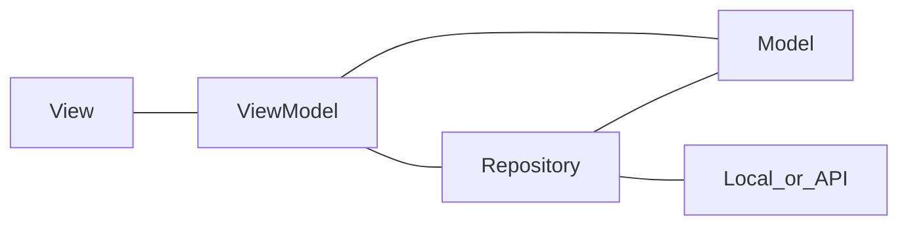

# ARCHITECTURE

This doc explains the architecture adopted to the in_out_recorder app.

## Design Pattern

MVVM + Repository

## Data

- StudyRecord
  - uuid
  - title
  - created date
  - updated date
  - status (done, doging, pending)
  - free tags
  - in or out
  - memo (markdown or plain text)
  - time
